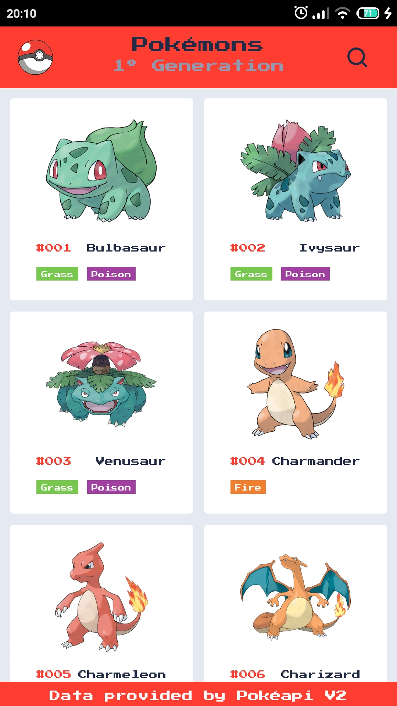
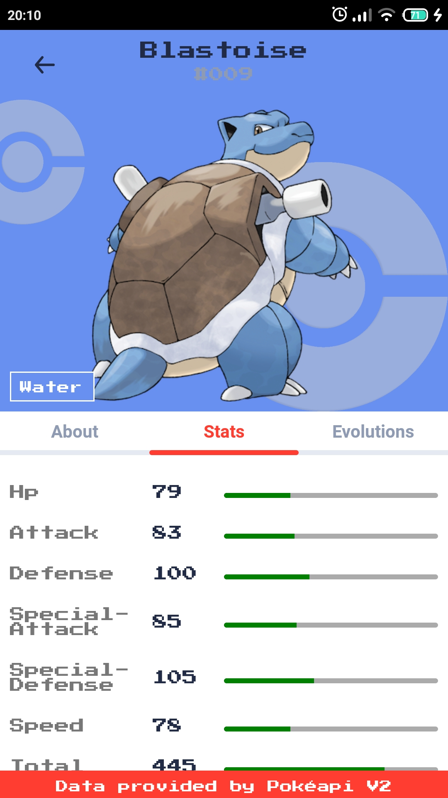

# Pokedex App

A pokedex app developed by [@Mazurco066](https://github.com/Mazurco066).
Expo publish url: [Pokedex](https://expo.io/@mazurco/pokedex).

## Screenshots

| List screen                          | Pokémon details                         |
| ------------------------------------ | --------------------------------------- |
|  |  |

## Libraries and Structure

This app was developed using

* **[Expo](https://expo.io/)** - React Native Framework
* **[UI Kitten](https://akveo.github.io/react-native-ui-kitten/)** - Visual Framework based on EVA Design
* **[PokeAPI](https://pokeapi.co/)** - Pokemon Data Api

## Setup

Assuming you have [yarn](https://yarnpkg.com/), run the following commands to install dependencies and run the App:

```sh
yarn install
yarn start
```

Obs: Dont forget to copy the content of .env.example file to a new .env file before starting

### License

This project is licensed under the MIT License. Check the [LICENSE](LICENSE) file for further details.